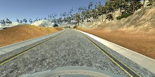

# Behavioral Cloning Project
[](http://www.udacity.com/drive)

[//]: # (Image References)

[model_viz]: ./images/model_resize.png "Model Visualization"
[center]: ./images/center.jpg "Center Driving"
[recovery_1]: ./images/recovery_1.jpg "Recovery Image"
[recovery_2]: ./images/recovery_2.jpg "Recovery Image"
[recovery_3]: ./images/recovery_3.jpg "Recovery Image"
[image6]: ./examples/placeholder_small.png "Normal Image"


Overview
---
Goals for this project:
* Use a self-driving car simulator to collect data of good driving behavior
* Build a Keras convolutional neural network (ConvNet) that predicts steering angles from images
* Train and validate the Keras model
* Test that the model successfully drives around a track without leaving the road


Project Structure
---

My project includes the following files:
* model.py containing the script to create and train the model
* drive.py for driving the car in autonomous mode
* model.h5 containing a trained convolution neural network 
* README.md (this Makrdown file) summarizing the results

Using the Udacity provided simulator and my drive.py file, the car can be driven autonomously around the track by executing:
```sh
python drive.py model.h5
```

The model.py file contains the code for training and saving the ConvNet. The file shows the pipeline I used for training and validating the model, and it contains comments to explain how the code works.


Model Architecture
---
My Keras model is based on [nVidia's own learning model](https://devblogs.nvidia.com/parallelforall/deep-learning-self-driving-cars) for self-driving cars, and consists of five convolutional layers and three fully connected layers. Dropout is used for wider layers to reduce overfitting, with keep probabilities of 0.25 (convolution) and 0.5 (fully connected) as suggested by [Keras' own example network](https://github.com/fchollet/keras/blob/master/examples/mnist_cnn.py).

The first three convolutional layers (lines 79-84) use a 5x5 filter, with a 2x2 stride to combat overfitting as an alternative to pooling layers.  The final two layers (lines 85-86) use a smaller 3x3 filter with a 1x1 stride to gain more accuracy on the fewer remaining pixels. After the 100, 50, and 10-unit wide fully connected layers (known as "Dense" in Keras, lines 89-94), a one-unit fully connected layer serves as the steering angle prediction output, thus completing the regression network.

Data is normalized using a Keras lambda layer, and images are cropped to remove the sky and the car itself to focus training efforts on the lane lines/road boundaries (lines 75-76).  Mean squared error was chosen as the appropriate loss function for regression, and optimization was performed via the Adam optimizer to reduce the need for manual tuning (line 100).


Model Design Process
---
The overall strategy for deriving a model architecture was to extend existing ConvNet architecture. My first step was to create a model based to the LeNet architecture. I thought this model might be appropriate because it could be setup, trained, and modified quickly, and performed well in previous projects.

In order to gauge how well the model was working, I split my image and steering angle data into training and validation sets with an 80/20 split. I found that my first model had low mean squared error on both the training and validation sets, implying it was fitting well yet not overfitting. However, the model would take a sharp turn off the track not long into the simulation.

Pooling layers, data augmentation, and adjusting the train/validation split to 70/30 helped the car stay on the road surface, but ultimately the car still drove off-track at some point. Transitions to other road edges such as dirt, water, and horizontal lines proved especially difficult. I felt a more powerful network was needed.

I implemented a version of nVidia's ConvNet model for their self-driving cars and removed the pooling layers in exchange for adding a 2x2 stride on the early convolutional layers. In the simulator the new model drove much more smoothly and was able to make a complete lap, but still went outside the lane lines occasionally. Adding dropout layers to both the convolutions and fully connected layers all but eliminated this behavior.

The final model architecture follows:
![alt text][model_viz]                                         


Training Set Creation & Training Strategy
---
Driving images and steering angles were captured using the Udacity driving simulator by manually driving around the track in a smooth, consistent manner, hewing as close to the ideal driving line as possible. As the simulator is based on the Unity engine, I was able to plug in a gaming controller and use the analog stick to set the throttle and driving angle. I found this provided much smoother driving and better angle data than keyboard input (which supports only full left/right turn or no turn).

To capture good driving behavior, I first recorded four laps on track one using center lane driving, two in each direction. Here is an example image:

![alt text][center]

I then recorded the vehicle recovering from the left side and right sides of the road back to center so that the vehicle would learn how to correct its own mistakes, and not simply run off the road if it ever left center line. As the model still had difficulty with sharp turns and the road to dirt visual transition, I elected to add additional recovery data for the final training. These images show what a recovery looks like:

![alt text][recovery_1]
![alt text][recovery_2]
![alt text][recovery_3]

To augment the data sat, I added horizontally flipped images and inverted angles (angle * -1.0) for each image/angle. This helped reduce the bias towards turning in a single direction. Despite having already added laps in the opposite direction, augmentation made dramatic improvement in the model's driving ability.

For the training process, I randomly shuffled the data set and put 30% of the data into a validation set, which appeared to improve driving performance vs. a 20% validation split. Throughout the process I found training on three epochs to be sufficient to minimize validation error yet not so much as to encourage overfitting. Additional epochs generally only served to increase training time with no noticeable improvement in driving performance.

Testing consisted of an autononous run through the simulator to verify that the vehicle could stay on the track. The video below shows how the simulator performed on the final model:
[](./video.mp4)
